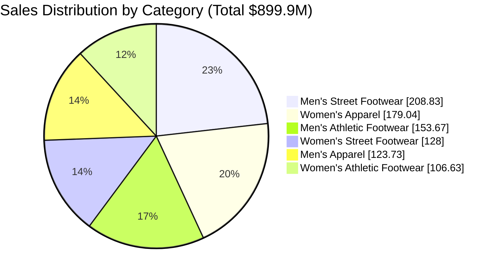

# 📊 Adidas US Sales Dashboard (2020-2021)
Power BI analysis of Adidas sales performance across US regions, product categories, and retail partners

[](https://powerbi.microsoft.com/)
[](https://www.latex-project.org/)
[](https://github.com/Youssefkammoun595/adidas_sales_dashboard_project)

## 🔍 Project Overview
Comprehensive analysis of **2.48M units sold** ($899.9M total sales) during 2020-2021 to identify:
- Regional performance disparities across US markets
- Product category profitability breakdown
- Retailer partnership effectiveness
- Impact of sales methods (Online/In-store/Outlet)
- Month-over-Month (MoM) growth trends

## 📂 Repository Structure
```plaintext
Adidas_Sales_Dashboard/
├── Data/                   # Raw sales datasets
│   ├── adidas_sales_2020.xlsx
│   └── adidas_sales_2021.xlsx
├── Documentation/          # Project report and academic documentation
│   ├── Power_BI_Project_Report.pdf
│   ├── Report.tex          # LaTeX source file
│   └── References/         # Research materials
├── Images/                 # Dashboard screenshots and visuals
│   ├── Home_Page.png
│   ├── Products_Page.png
│   ├── Sales_Analysis.png
│   └── Visual_Assets/      # Icons and design elements
├── PowerBI_Files/          # Interactive dashboard source
│   ├── Adidas_Dashboard.pbix
│   └── Data_Model/         # Enhanced data model components
├── .gitignore              # Version control configuration
└── README.md               # Project documentation
```

📊 Key Insights
1. Regional Dominance
West region generated highest sales ($269.94M • 30% of total)
https://Images/Sales_Analysis.png

2. Product Category Breakdown
Men's Street Footwear topped sales ($208.83M) with Women's Apparel close behind ($179.04M)



🛠️ Dashboard Features
Page	Highlights	Preview

Home	Executive KPIs • Navigation • Time filters	https://Images/Home_Page.png.

Sales Analysis	Regional maps • Monthly trends • Retailer rankings • Product comparisons	https://Images/Sales_Analysis.png.

Products	Category drill-down • Dynamic filtering • Image integration • MoM trends	https://Images/Products_Page.png.


Advanced Functionality:

🔄 Dynamic product image loading based on selection

🔗 Cross-filtering between all visuals

📈 Advanced DAX measures for MoM calculations

📱 Responsive mobile design

🗺️ Interactive geographic visualization

⚙️ Technical Implementation
Data Pipeline:
```mermaid
flowchart TD
    A[Raw Excel Data] --> B[Power Query Processing]
    B --> C[Data Cleaning & Transformation]
    C --> D[DAX Measures Creation]
    D --> E[Data Modeling]
    E --> F[Interactive Dashboard]
    F --> G[LaTeX Report Generation]
````
Key DAX Measures:

// Month-over-Month Growth Calculation
Units Sold MoM % = 
VAR CurrentMonth = [Units Sold]
VAR PreviousMonth = CALCULATE([Units Sold], PREVIOUSMONTH('Date'[Date]))
RETURN 
DIVIDE((CurrentMonth - PreviousMonth), PreviousMonth, 0)

// Dynamic Product Image Loading
Product Image = 
VAR SelectedProduct = SELECTEDVALUE(Products[Product ID])
RETURN
CALCULATE(
    VALUES(Products[Image URL]),
    Products[Product ID] = SelectedProduct
)
